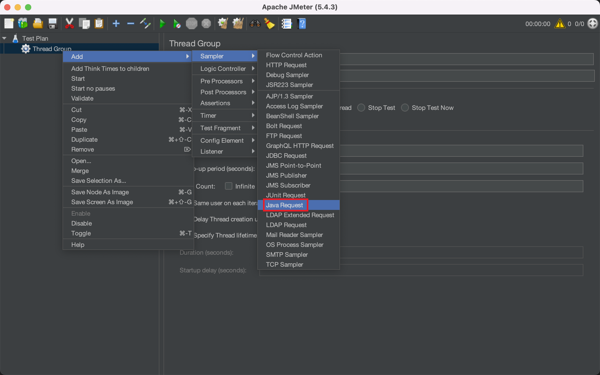
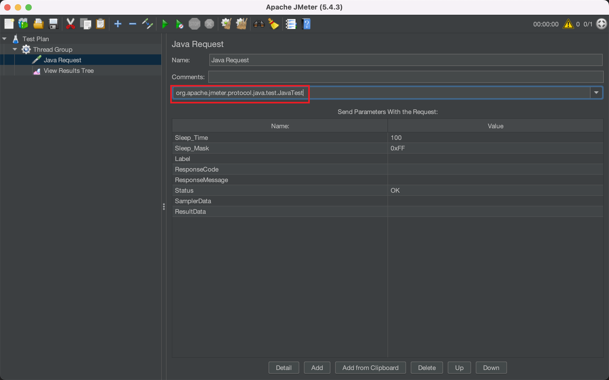

# 概述
在 `JMeter` 中， 支持我们可以编写 `Java` 代码来发送请求， 用来提高拓展性， 如下图所示



# 实践 
要成为 `JMeter` 可识别的脚本， 该脚本需要继承 `AbstractJavaSamplerClient` 类

```java
public class HttpBinPostCase extends AbstractJavaSamplerClient {
    HttpClient httpClient;
    String url;
    @Override
    public void setupTest(JavaSamplerContext context) {
        httpClient = HttpClients.createDefault();
        url = context.getParameter("url");
    }

    @SneakyThrows
    @Override
    public SampleResult runTest(JavaSamplerContext context) {
        HttpPost httpPost= new HttpPost(url);
        SampleResult sampleResult=new SampleResult();
        sampleResult.setSampleLabel("httpbin post case");
        sampleResult.sampleStart();
        HttpResponse result = httpClient.execute(httpPost);

        String entity= EntityUtils.toString(result.getEntity());
        if (result.getStatusLine().getStatusCode()==200){
            sampleResult.setSuccessful(true);
            sampleResult.setResponseCodeOK();
        }else {
            sampleResult.setSuccessful(false);
            sampleResult.setResponseCode(String.valueOf(result.getStatusLine().getStatusCode()));
        }
        sampleResult.setResponseData(entity, "utf-8");
        // 在这里存储API 返回值
        JMeterSampleResultMap.result.put(context.getJMeterVariables().getThreadName(), entity);
        return sampleResult;
    }

    @Override
    public void teardownTest(JavaSamplerContext context) {
        super.teardownTest(context);
    }

    @Override
    public Arguments getDefaultParameters() {
        Arguments arguments = new Arguments(); 
        arguments.addArgument("url", "https://httpbin.org/post");
        return arguments; 
    }
}

```
然后将该项目打包成一个 `Jar` 包， 再引入 `JMeter` 中即可
