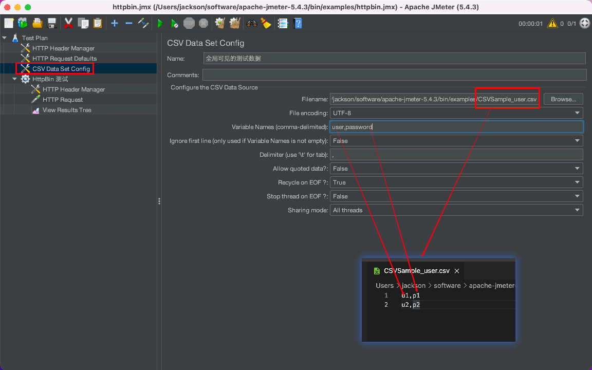
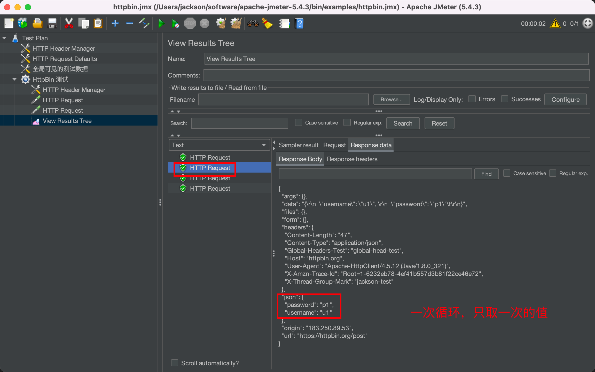
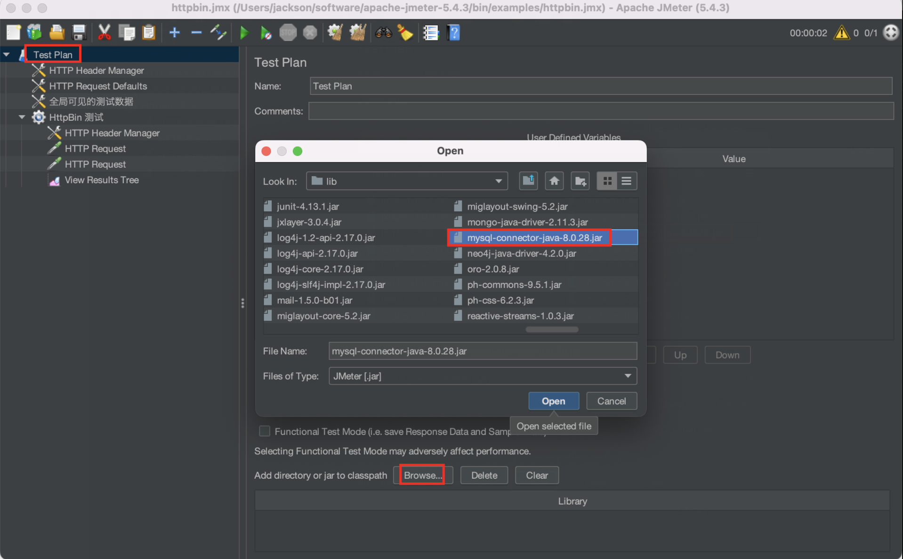
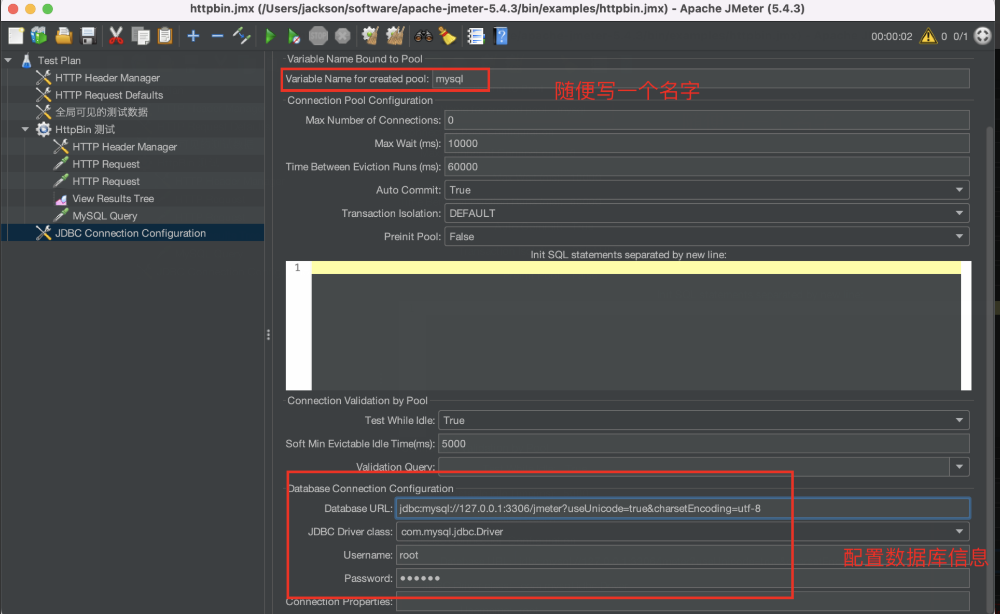
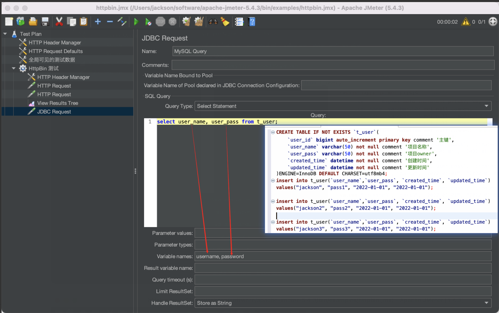
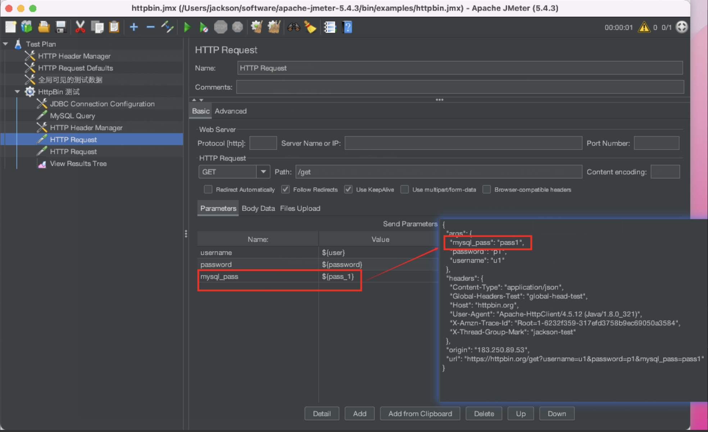
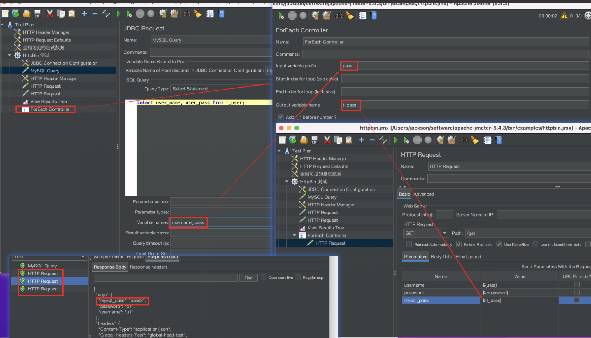

# CSV 
第一种最简单的也最常见的是通过 csv 来传入测试数据

接下来我们测试下 CSV 取值

# Mysql 数据库 
需要将 [Mysql Driver Lib](https://search.maven.org/artifact/mysql/mysql-connector-java/8.0.28/jar) 下载保存的 lib 文件夹

那么如何遍历数据库中的每一个值呢？

1. 使用 foreach 遍历 

2. 先算出数据库有多少数据， 然后用 for 循环遍历

## foreach： 

新建一个  FoeEach 的 controller

Input variable： 指的是你之前设置的变量名

Output variable： 指的是你之后从这个变量集合中取出来的单个变量的名字

