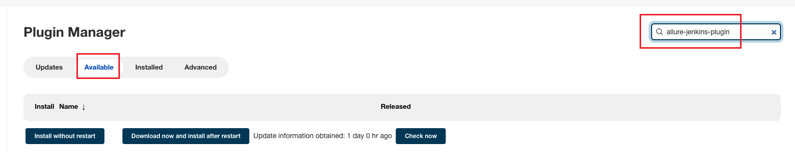
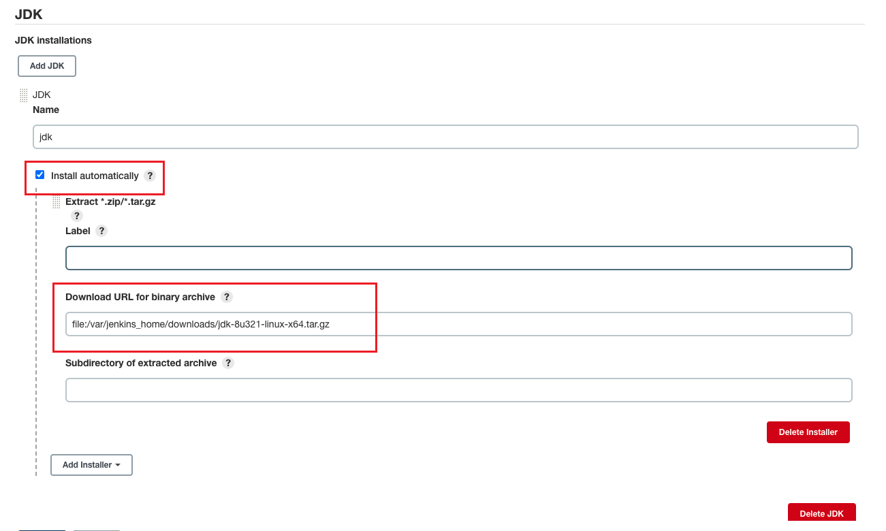
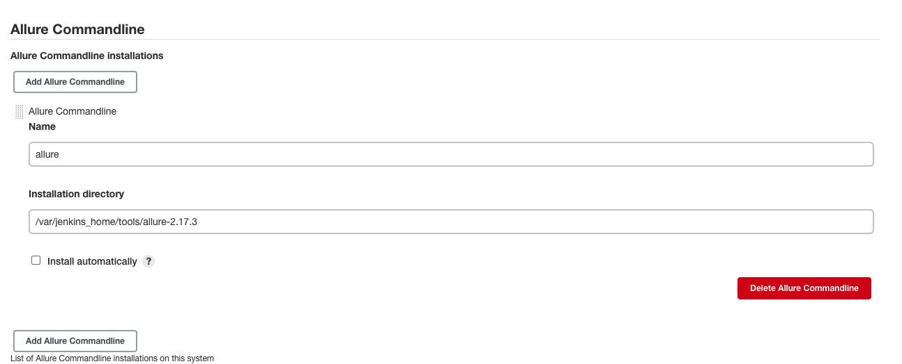
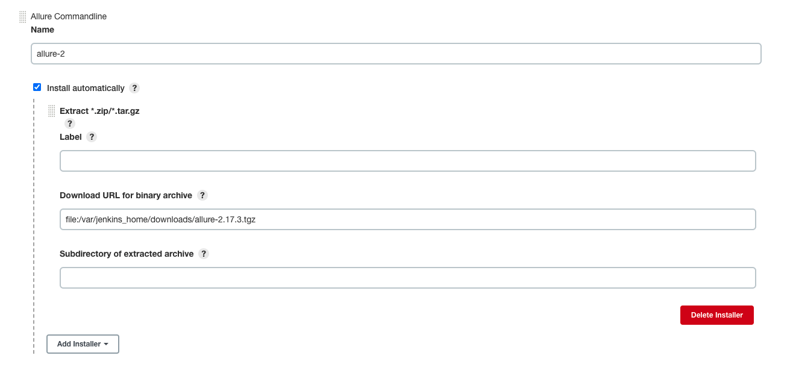
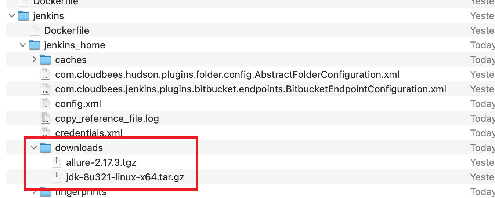

# 概述
在自动化测试中，我们经常使用 `allure` 来作为项目的报告。 本文记录一下如何集成 `allure` 到 `jenkins` 中

# 配置 allure
## 安装插件

## 配置 JDK

## 配置下载好的 allure
你可以下载好，放到 `jenkins_home/tools` 下

或者，你可以让 jenkins 自己解压



# 测试
这一切配置好之后， 就可以写 jenkinsfile 运行一下测试效果
```groovy
pipeline {
    agent any
    stages {
        stage ('Run test') {
            steps {
               sh "./gradlew -Denv=qa sub:on-test"
            }
        }
    }
     post {
        always {
            allure includeProperties: false, jdk: '', results: [[path: "sub/reports/qa/allure-results"]]
        }
     }
}
```